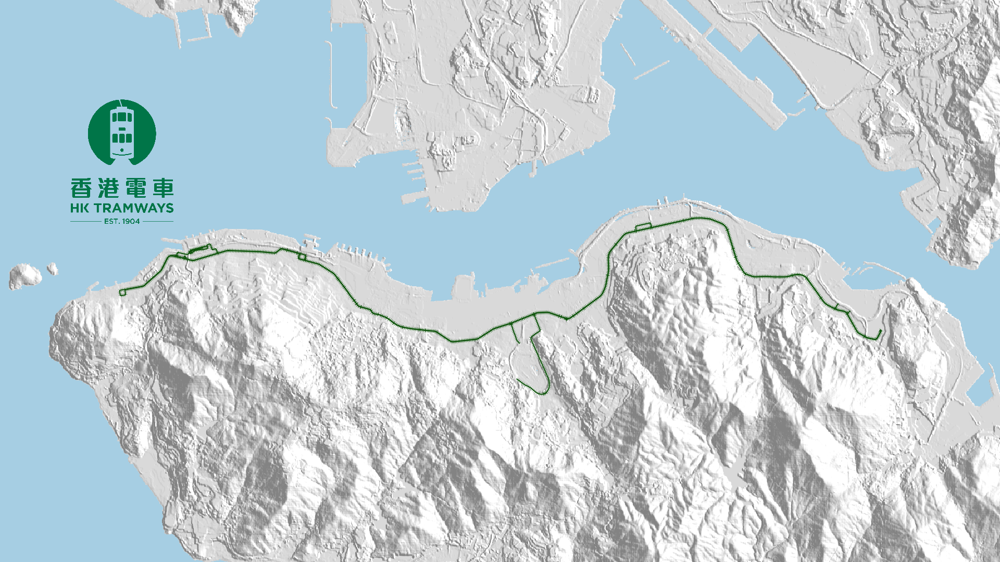
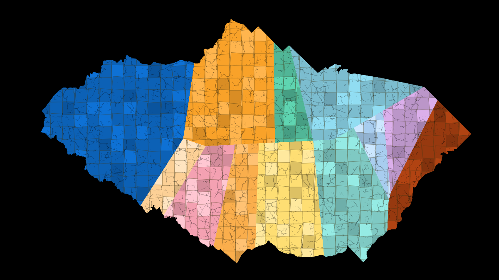

# #30DayMapChallenge 🌎🌏🌎

This is my repository for all my submissions for the #30DayMapChallenge initiated by [@tjukanovt](https://twitter.com/tjukanov). For the official repository of the event, please see this [GitHub repo](https://github.com/tjukanovt/30DayMapChallenge).

For more about me, you can visit my [personal website](https://clronniema.gitlab.io/) or [Twitter account](https://twitter.com/clronniema).

## || Day 1 || Points - Hong Kong Lampposts Map

A collection of lampposts in Hong Kong that are found in the now open dataset Digital Topogrphic Map iB1000. Interestingly as we have lampposts that are placed relatively closer than other major cities, the lampposts can really become an impressionist tool to illustrate public roads in Hong Kong.

🗺 Data: iB1000 Utility Point, Lands Department Hong Kong.

🔨🔧 Tools and Steps: QGIS, points feature blending hard light

## || Day 2 || Lines - HK Tramways

A quick render of the iconic tram tracks on the Hong Kong Island. It was mostly built on mainly flat terrain around 100 years ago and has become a reminder of our natural coastline. My grandma would travel from East side to West side, to buy kilos of rice and carry it back on tram due to its cheap fare.

🗺 Data: iB5000 Rail Line, Lands Department Hong Kong.

🔨🔧 Tools and Steps: QGIS, hillshade styling for DEM, line styling for rail

## || Day 3 || Polygons - Shatin MTR Voronois

This is a new version of my [Hong Kong Train Mosaic Tile](https://plugins.qgis.org/styles/88/) style on QGIS style, that I submitted in 2021 April. Instead of the Hong Kong Island, stations used were all in the Shatin district of Hong Kong. Station colors can be found [here](https://svgur.com/i/JML.svg).

🗺 Data: [District Boundary, Home Affairs Departent](https://data.gov.hk/en-data/dataset/hk-had-json1-hong-kong-administrative-boundaries), OSM tag "railway=station"

🔨🔧 Tools and Steps: QGIS, calculate voronoi of selected stations, manual adjustments, apply QGIS style.

## || Day 4 || Hexagons - Hong Kong Buildings in Hexagons

Summary of number of buildings grouped into hexagons in Hong Kong, each hexagon is 3km wide.

🗺 Data: iB5000 Buildings Point, Lands Department Hong Kong. Digital Terrain Model, Lands Department Hong Kong.

🔨🔧 Tools and Steps: QGIS, create grid, summarize building points in hexagon, calculate max elevation from DEM, change to gradual symbols and add border layer to simple fill.