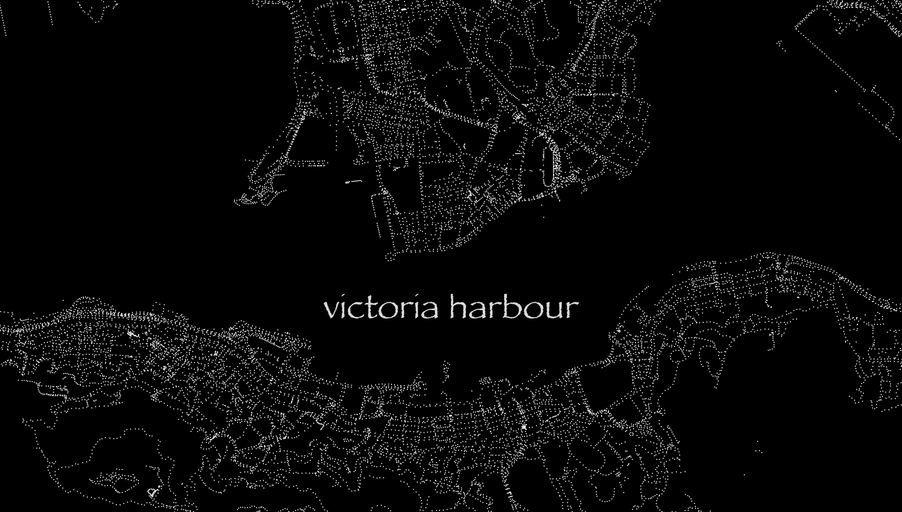
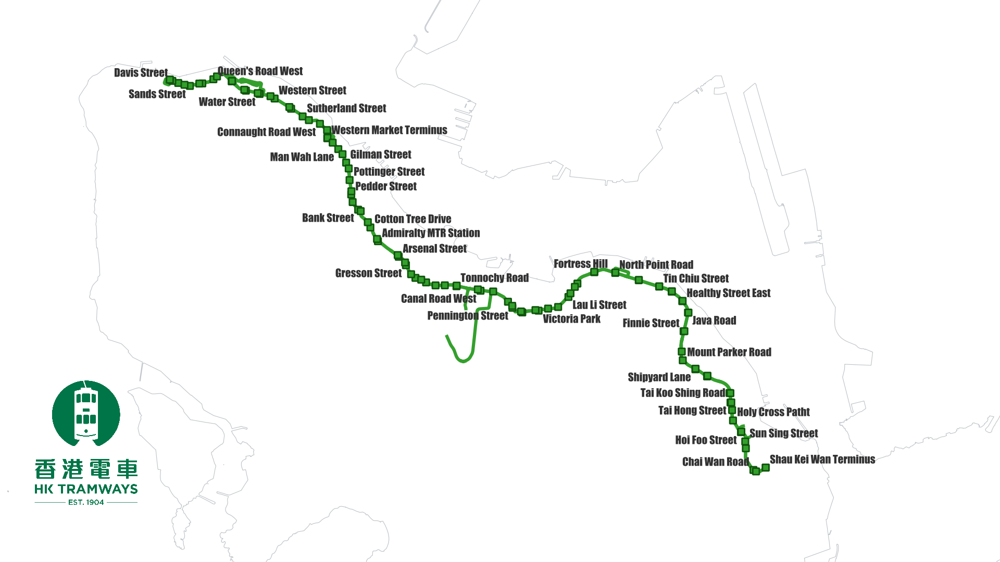
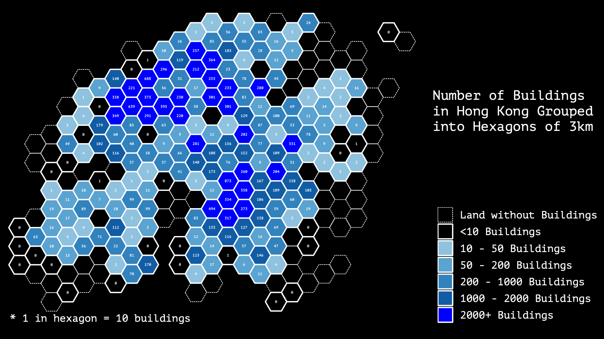
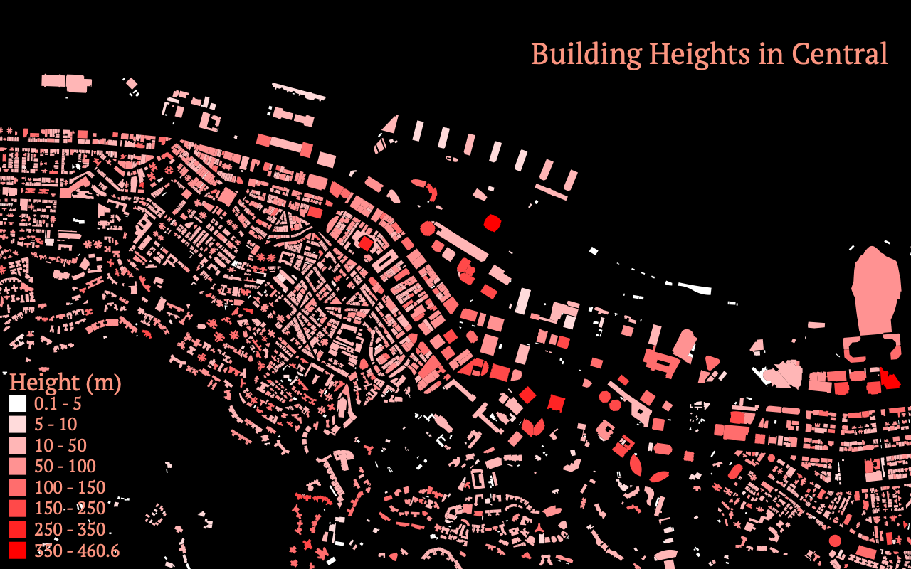

# #30DayMapChallenge 🌎🌏🌎

This is my repository for all my submissions for the #30DayMapChallenge initiated by [@tjukanovt](https://twitter.com/tjukanov). For the official repository of the event, please see this [GitHub repo](https://github.com/tjukanovt/30DayMapChallenge).

For more about me, you can visit my [personal website](https://clronniema.gitlab.io/) or [Twitter account](https://twitter.com/clronniema).

## || Day 1 || Points - Hong Kong Lampposts Map

A collection of lampposts in Hong Kong that are found in the now open dataset Digital Topogrphic Map iB1000. Interestingly as we have lampposts that are placed relatively closer than other major cities, the lampposts can really become an impressionist tool to illustrate public roads in Hong Kong.

🗺 Data: iB1000 Utility Point, Lands Department Hong Kong.

🔨🔧 Tools and Steps: QGIS, points feature blending hard light

[Link to Tweet](https://twitter.com/clronniema/status/1455142587371769860)

## || Day 2 || Lines - HK Tramways

A quick render of the iconic tram tracks on the Hong Kong Island. It was mostly built on mainly flat terrain around 100 years ago and has become a reminder of our natural coastline. My grandma would travel from East side to West side, to buy kilos of rice and carry it back on tram due to its cheap fare.

🗺 Data: iB5000 Rail Line, Lands Department Hong Kong.

🔨🔧 Tools and Steps: QGIS, line styling for rail

[Link to Tweet](https://twitter.com/clronniema/status/1455504970153816068)

## || Day 3 || Polygons - Shatin MTR Voronois

This is a new version of my [Hong Kong Train Mosaic Tile](https://plugins.qgis.org/styles/88/) style on QGIS style, that I submitted in 2021 April. Instead of the Hong Kong Island, stations used were all in the Shatin district of Hong Kong. Station colors can be found [here](https://svgur.com/i/JML.svg).

🗺 Data: [District Boundary, Home Affairs Departent](https://data.gov.hk/en-data/dataset/hk-had-json1-hong-kong-administrative-boundaries), OSM tag "railway=station"

🔨🔧 Tools and Steps: QGIS, calculate voronoi of selected stations, manual adjustments, apply QGIS style.

[Link to Tweet](https://twitter.com/clronniema/status/1455867363375517701)

## || Day 4 || Hexagons - Hong Kong Buildings in Hexagons

Summary of number of buildings grouped into hexagons in Hong Kong, each hexagon is 3km wide.

🗺 Data: iB5000 Buildings Point, Lands Department Hong Kong. Digital Terrain Model, Lands Department Hong Kong.

🔨🔧 Tools and Steps: QGIS, create grid, summarize building points in hexagon, calculate max elevation from DEM, change to gradual symbols and add border layer to simple fill.

[Link to Tweet](https://twitter.com/clronniema/status/1456199546694995969)

## || Day 6 || Red - Forest Loss in Hong Kong

Simple time series animation of forest loss in Hong Kong per year. Hong Kong is a small place with large green cover, at least 40% of our land is classified as country parks. 

🗺 Data: [GLAD - Global Forest Change](https://glad.earthengine.app/)

🔨🔧 Tools and Steps: Extract raster from ROI, create summary of no. of pixels table by year, set rule based symbology, create Atlas and control symbology by year value.

[Link to Tweet](https://twitter.com/clronniema/status/1457017999190151169)

## || Day 7 || Green - Green Land Cover in Hong Kong

Displaying GLAD forest cover data with simple symbology. Value of raster pixel represents percentage of area covered by tree canopy of 5m or higher. I did not realise how much green there is in Hong Kong.

🗺 Data: [GLAD - Global Forest Change](https://glad.earthengine.app/)

🔨🔧 Tools and Steps: Extract raster from ROI, set graduated fill with green as color ramp.

[Link to Tweet](https://twitter.com/clronniema/status/1457256511734906881)

## || Day 8 || Blue - Pencil Contours on Graph Paper

Twisting the theme, using blue as an ordinary piece of paper I've used as a student to trace a map. The shown area is Tung Ping Chau of Hong Kong, which is a small island that is a local tourist attraction. Refer to this [QGIS pencil styles repository](https://github.com/AsgerPetersen/qgis_styles/tree/master/pencil_styles). Huge credits to Asger Petersen for making this available.

🗺 Data: iB5000 Contours Lands Department

🔨🔧 Tools and Steps: Apply pencil style and adjust, simple! 

[Link to Tweet](https://twitter.com/clronniema/status/1457618894068326404)

## || Day 9 || Monochrome - Building Heights in Central

A simple take on the monochrome topic, displaying building heights from low to high. Perfect for an area with low buildings and tallest skyscrapers in the world.

🗺 Data: iB1000 Buildings Lands Department

🔨🔧 Tools and Steps: Filter unwanted building types and filter buildings too small, apply graduated symbology.

[Link to Tweet](https://twitter.com/clronniema/status/1457981290842497030)

## || Day 9 || Mapping with New Tool - Lamma Island using Blender

Based on Klas Karlsson's [tutorial](https://www.youtube.com/watch?v=AJJNX243k9E&ab_channel=KlasKarlsson), using simple effects on Blender. Simulating the aerial view of Lamma Island on a late afternoon with air filled with aerosols.

🗺 Data: Hong Kong 5m Resolution DTM by Lands Deparment, Google Satellite imagery

🔨🔧 Tools and Steps: Refer to tutorial link above

[Link to Tweet](https://twitter.com/clronniema/status/1457981290842497030)